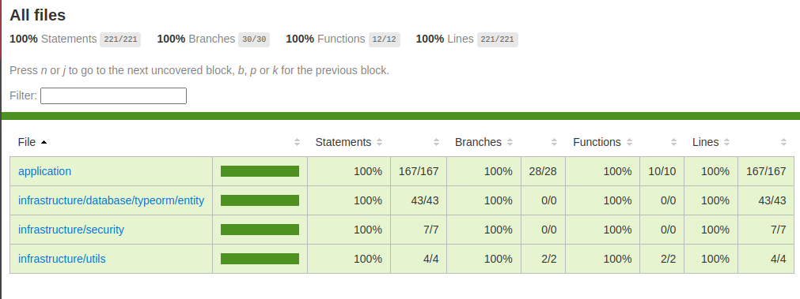

# 🚀 Teste Caveo api

Este projeto foi desenvolvido com as seguintes tecnologias:

- **Node.js** 🟩
- **KoaJS** ⚡
- **TypeScript** 💻
- **TypeORM** 🛠️
- **PostgreSQL** 🗄️
- **AWS Cognito** ☁️ para autenticação

E o melhor de tudo: **100% de cobertura de testes unitários com Jest** 🧪!

## 🛠️ Funcionalidades

- **API Restful** construída com **KoaJS** e **TypeScript**.
- **Autenticação** e **autorização** usando **AWS Cognito**.
- Banco de dados **PostgreSQL** com **TypeORM** para manipulação de dados.
- **Testes unitários** 100% cobertos com **Jest**.
- **Suporte completo para migrações** de banco de dados com **TypeORM**.

## 🚀 Instruções para Rodar o Projeto

### 🏃‍♂️ Rodando Localmente

Para rodar o projeto localmente, execute o seguinte comando:

```
yarn dev
```

Isso irá iniciar o servidor **Node.js** localmente e você poderá acessar a API diretamente.

### 🐳 Rodando no Docker

Para rodar o projeto diretamente no **Docker**, utilize o seguinte comando:

```
yarn start:docker
```

Este comando faz todo o trabalho para você:

- Cria o servidor **Node.js**.
- Cria o banco de dados **PostgreSQL**.
- Executa as **migrations** automaticamente, sem a necessidade de comandos adicionais.

### ⚙️ Criando Novas Migrations

Para criar uma nova migration, execute:

```
yarn typeorm migration:create src/infrastructure/database/typeorm/migrations/table-name
```

Substitua `table-name` pelo nome da tabela ou alteração que deseja realizar.

### 🔄 Sincronizando as Migrations com o Banco de Dados

Para aplicar as migrations no banco de dados, execute:

```
yarn migration
```

Isso irá sincronizar as migrations criadas com o banco de dados.

## 🧪 Testes

O projeto está com **100% de cobertura de testes unitários** usando **Jest**. Para rodar os testes, utilize o comando:

```
yarn test
```

Os testes serão executados e você verá o relatório com o status de cada um.

### 📊 Coverage Report

Aqui está o **coverage report** dos testes:



## 🛠️ Tecnologias Utilizadas

- **Node.js**: Ambiente de execução JavaScript 🟩.
- **KoaJS**: Framework para construção de APIs ⚡.
- **TypeScript**: Superset do JavaScript com tipagem estática 💻.
- **TypeORM**: ORM para interação com o banco de dados PostgreSQL 🛠️.
- **PostgreSQL**: Banco de dados relacional 🗄️.
- **AWS Cognito**: Serviço de autenticação e gerenciamento de usuários ☁️.
- **Jest**: Framework de testes 🧪.
